# 🔑 Implementación del Proceso de Login

Este documento describe en detalle el flujo de autenticación y acceso al dashboard de administración de la API RAG, utilizando tokens JWT y un proceso de inicio de sesión basado en correo electrónico y contraseña.

## Tabla de Contenido

* [Flujo General del Login y Redireccion](#flujo-general-del-login-y-redireccion)
* [Componentes del Frontend](#componentes-del-frontend)
* [Endpoint de Autenticacion en el Backend](#endpoint-de-autenticacion-en-el-backend)
* [Manejo de Tokens JWT](#manejo-de-tokens-jwt)
* [Proteccion del Dashboard](#proteccion-del-dashboard)
* [Diagrama de Secuencia del Login](#diagrama-de-secuencia-del-login)

---

## Flujo General del Login y Redireccion

El proceso de login está diseñado para asegurar que solo los usuarios autenticados puedan acceder a las funcionalidades del dashboard de administración. Sigue estos pasos:

1.  **Acceso Inicial:** Cuando un usuario intenta acceder a la URL principal de la aplicación (`/`), el script en `index.html` verifica si existe un token JWT en el `localStorage` del navegador.
2.  **Redirección a Login:** Si no se encuentra un token válido, el navegador es redirigido automáticamente a la página de login (`/login.html`).
3.  **Inicio de Sesión:** En la página de login, el usuario introduce sus credenciales (email y contraseña).
4.  **Autenticación y Token:** Al enviar el formulario, una petición `POST` se envía al endpoint `/api/users/login` del backend. Si las credenciales son correctas, el backend genera un token JWT y lo devuelve junto con la información básica del usuario.
5.  **Almacenamiento y Redirección al Dashboard:** El frontend guarda el token JWT y el nombre de usuario en `localStorage`. Inmediatamente después, el navegador es redirigido de nuevo a la URL principal (`/`).
6.  **Acceso al Dashboard:** Una vez en el dashboard, las peticiones subsecuentes a la API para cargar datos (como la lista de usuarios) incluyen el token JWT en el encabezado `Authorization`. El backend valida este token, permitiendo el acceso a la información.
7.  **Manejo de Sesiones Invalidas:** Si una petición a la API devuelve un error de autenticación (401 o 403), el frontend limpia el token inválido del `localStorage` y redirige al usuario de vuelta a la página de login.

[Volver a la tabla de contenido](#tabla-de-contenido)

---

## Componentes del Frontend

La implementación del login en el frontend se basa en los siguientes archivos:

### `src/public/login.html`
Define la estructura HTML del formulario de inicio de sesión, incluyendo campos para email y contraseña, y un botón de envío. Contiene un contenedor para mensajes de error.

### `src/public/css/login.css`
Proporciona los estilos CSS para la página de login, asegurando una interfaz de usuario limpia y centrada.

### `src/public/js/login.js`
Contiene la lógica JavaScript para:
- Capturar los datos del formulario.
- Enviar una petición `POST` al endpoint `/api/users/login`.
- Procesar la respuesta del backend: si es exitosa y contiene un token, lo almacena junto con el nombre de usuario en `localStorage` y redirige a la raíz (`/`).
- Mostrar mensajes de error en caso de credenciales incorrectas o problemas de conexión.

### `src/views/index.html`
El archivo principal del dashboard. Incluye un script `inline` que se ejecuta al cargar la página para:
- Verificar la existencia de un token JWT en `localStorage`.
- Si no hay token, redirige al usuario a `/login.html`.
- Si existe un token, carga el nombre de usuario desde `localStorage` y lo muestra en el encabezado del dashboard.

### `src/public/js/main.js`
Este script maneja la lógica de carga de datos para el dashboard y las interacciones con la tabla (como cargar usuarios). Ha sido modificado para:
- Incluir el token JWT del `localStorage` en el encabezado `Authorization: Bearer <token>` de todas las peticiones `fetch` a la API (ej., `/api/users`).
- Detectar respuestas `401 Unauthorized` o `403 Forbidden` de la API. En estos casos, limpia el `localStorage` (eliminando el token y el nombre de usuario) y redirige al usuario a la página de login, forzando una nueva autenticación.

[Volver a la tabla de contenido](#tabla-de-contenido)

---

## Endpoint de Autenticacion en el Backend

El backend procesa las solicitudes de login a través de un endpoint específico:

### `POST /api/users/login`
Ubicado en `src/controllers/userController.js` (función `login`) y enrutado en `src/routes/userRoutes.js`.

**Funcionalidad:**
- Recibe el `email` y la `password` del cuerpo de la petición.
- Busca el usuario en la base de datos utilizando Prisma (`prisma.user.findUnique`).
- Compara la contraseña proporcionada con el `password_hash` almacenado en la base de datos utilizando `bcrypt.compare`.
- Valida el `status` del usuario (`active`).
- Si las credenciales son válidas y el usuario está activo, genera un token JWT (`jwt.sign`) utilizando un `JWT_SECRET` almacenado en las variables de entorno.
- Actualiza la marca de tiempo de `last_login` del usuario.
- Devuelve el objeto del usuario (sin el hash de contraseña) y el token JWT al frontend.
- En caso de credenciales inválidas o usuario inactivo, retorna una respuesta de error (401 o 403).

[Volver a la tabla de contenido](#tabla-de-contenido)

---

## Manejo de Tokens JWT

Los JSON Web Tokens (JWT) son fundamentales para la autenticación sin estado en el sistema:

### Generación
- El backend genera el JWT tras un login exitoso, firmándolo con un `JWT_SECRET` seguro (una cadena de texto larga y aleatoria). El token incluye el `id` del usuario y una fecha de expiración (`expiresIn: '24h'`).

### Almacenamiento en el Frontend
- El token recibido se guarda en `localStorage` del navegador. Esto permite que el token persista incluso si el usuario cierra y reabre la pestaña del navegador (hasta que expire o sea eliminado explícitamente).

### Envío en Peticiones
- Para acceder a recursos protegidos (endpoints que requieren autenticación), el frontend incluye el token en el encabezado `Authorization` de la petición HTTP, con el formato `Bearer <token>`.

### Verificación en el Backend
- El middleware `src/middleware/auth.js` intercepta las peticiones protegidas. Extrae el token del encabezado `Authorization`, lo verifica usando el mismo `JWT_SECRET` y busca el usuario asociado en la base de datos. Si el token es válido y el usuario está activo, permite el acceso a la ruta solicitada.

[Volver a la tabla de contenido](#tabla-de-contenido)

---

## Proteccion del Dashboard

La interfaz de administración está protegida para evitar el acceso no autorizado:

1.  **Redirección Inicial (Frontend):** Como se mencionó, la página `index.html` contiene un script que verifica la presencia de un token en `localStorage`. Si no existe, el usuario es inmediatamente redirigido a `/login.html`.
2.  **Middleware de Autenticación (Backend):** Todas las rutas de API que acceden a datos sensibles o realizan operaciones de gestión (como `/api/users` para listar o eliminar usuarios) están protegidas por el middleware `auth`. Este middleware garantiza que solo las peticiones con un token JWT válido y activo puedan proceder.
3.  **Manejo de Respuestas de Error (Frontend):** El script `main.js` está configurado para detectar respuestas `401 Unauthorized` o `403 Forbidden` de la API. Ante estas respuestas, asume que la sesión ha expirado o el token es inválido, limpia el `localStorage` y redirige al usuario al login, reforzando la seguridad.

[Volver a la tabla de contenido](#tabla-de-contenido)

---

## Diagrama de Secuencia del Login

```mermaid
sequenceDiagram
    participant Navegador
    participant FrontendApp
    participant BackendAPI
    participant BaseDeDatos

    Navegador->>FrontendApp: Acceder a /
    alt No hay Token JWT
        FrontendApp->>Navegador: Redirigir a /login.html
        FrontendApp->>Navegador: Cargar login.html
        FrontendApp->>Navegador: Mostrar Formulario de Login
    end

    Navegador->>FrontendApp: Enviar Email/Contraseña (Formulario)
    FrontendApp->>BackendAPI: POST /api/users/login (Email, Contraseña)
    BackendAPI->>BaseDeDatos: Buscar Usuario por Email
    BaseDeDatos-->>BackendAPI: Datos del Usuario
    BackendAPI->>BackendAPI: Verificar Contraseña (bcrypt)
    BackendAPI->>BackendAPI: Generar Token JWT (jwt.sign)
    BackendAPI->>BaseDeDatos: Actualizar last_login
    BackendAPI-->>FrontendApp: Retornar Token JWT + Datos Usuario

    FrontendApp->>FrontendApp: Guardar Token y Username en localStorage
    FrontendApp->>Navegador: Redirigir a /
    Navegador->>FrontendApp: Cargar index.html (Dashboard)

    FrontendApp->>FrontendApp: Verificar Token en localStorage
    alt Token válido
        FrontendApp->>BackendAPI: GET /api/users (Header: Authorization: Bearer <token>)
        BackendAPI->>BackendAPI: Validar Token JWT (middleware auth)
        BackendAPI->>BaseDeDatos: Obtener Lista de Usuarios
        BaseDeDatos-->>BackendAPI: Datos de Usuarios
        BackendAPI-->>FrontendApp: Retornar Lista de Usuarios
        FrontendApp->>Navegador: Renderizar Tabla de Usuarios en Dashboard
    else Token inválido o no existe
        FrontendApp->>FrontendApp: Limpiar localStorage
        FrontendApp->>Navegador: Redirigir a /login.html (Bucle)
    end

    Note over FrontendApp,BackendAPI: Peticiones subsiguientes con Token
    FrontendApp->>BackendAPI: DELETE /api/users/:id (Header: Authorization)
    BackendAPI->>BackendAPI: Validar Token (middleware auth)
    BackendAPI->>BaseDeDatos: Eliminar Usuario
    BaseDeDatos-->>BackendAPI: Resultado
    BackendAPI-->>FrontendApp: Respuesta (204 No Content)
    FrontendApp->>FrontendApp: Recargar lista de usuarios
```

[Volver a la tabla de contenido](#tabla-de-contenido)

---

 📆 *Última actualización:* Junio 2025 